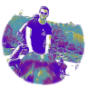
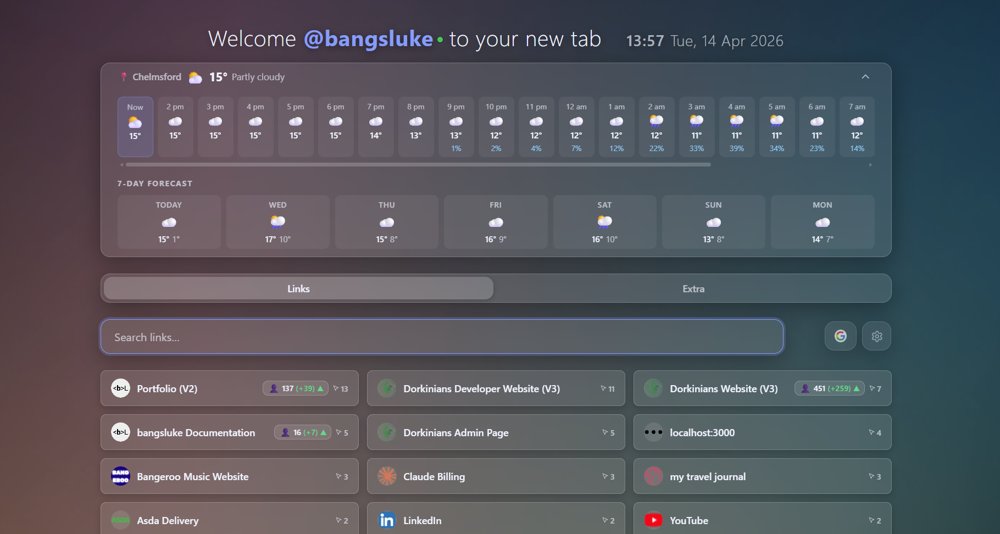

<p align="center">
  
</p>

<h1 align="center">New Tab V2</h1>

<p align="center">
  <strong>Local-first new tab dashboard</strong> with categorized links, fuzzy search, weather, analytics, and utility widgets in a glassmorphism interface.
</p>

<p align="center">
  <a href="#project-overview">🌐 Project Overview</a> •
  <a href="#quick-start">💻 Quick Start</a> •
  <a href="#key-features">✨ Features</a> •
  <a href="#tech-stack">🛠️ Tech Stack</a> •
  <a href="#architecture">🏗️ Architecture</a> •
  <a href="./SETUP-GUIDE.md">📚 Setup Guide</a>
</p>

<p align="center">
<a href="https://app.netlify.com/projects/bangsluke-new-tab/deploys" style="text-decoration: none;">
    
  </a>
  
  
  
  
</p>

<p align="center">
  
</p>

## Table of Contents

- [Table of Contents](#table-of-contents)
- [Project Overview](#project-overview)
- [Key Features](#key-features)
- [Tech Stack](#tech-stack)
- [Screenshots](#screenshots)
- [Architecture](#architecture)
- [Quick Start](#quick-start)
  - [1. Install dependencies](#1-install-dependencies)
  - [2. Configure Obsidian source](#2-configure-obsidian-source)
  - [3. (Optional) Add API keys](#3-optional-add-api-keys)
  - [4. Generate local data files](#4-generate-local-data-files)
  - [5. Run locally](#5-run-locally)
- [Configuration](#configuration)
  - [Obsidian Source Config](#obsidian-source-config)
  - [Environment Variables](#environment-variables)
  - [Obsidian Table Format](#obsidian-table-format)
- [Widgets and Extras](#widgets-and-extras)
- [Football Data](#football-data)
- [Deploying to Netlify](#deploying-to-netlify)
- [Diagnostics (Debugging)](#diagnostics-debugging)
- [File Structure](#file-structure)

## Project Overview

New Tab V2 replaces a default browser tab with a locally controlled dashboard that prioritizes quick access, low friction search, and useful at-a-glance context.

The app reads links from an Obsidian markdown table, enriches them with optional analytics and click data, and presents everything in a responsive two-tab layout:
- `Links` tab for search, sorting, and link usage
- `Extra` tab for weather, football, news, GitHub activity, and BTC/GBP market context

## Key Features

- **Obsidian-powered link source**: Parse a markdown table into `data/links.json` via `npm run refresh`.
- **Fuzzy and tag-aware search**: Typo-tolerant matching across name, group, and tags using Fuse.js.
- **Usage tracking**: Per-link click counts, recency grouping, and reset options by time range.
- **Umami trends integration**: Optional visitors/pageviews/visits deltas with cached metric toggles.
- **Local-first persistence**: UI state, sort mode, selected metric/period, and click stats in `localStorage`.
- **Rich utility widgets**: Weather, football table/fixtures, GitHub heatmap, BBC headlines, BTC/GBP chart.
- **Glassmorphism UI**: Responsive cards with desktop/mobile layouts and a scroll-to-top FAB.
- **Netlify-compatible static deployment**: Build-time config generation plus serverless proxies for protected API access.

## Tech Stack

| Concern | Solution |
|---------|----------|
| Runtime UI | Vanilla JavaScript (ES modules), HTML, CSS |
| Search | [Fuse.js](https://fusejs.io/) (vendor file in `assets/vendor`) |
| Icons | [Lucide](https://lucide.dev/) (vendor file in `assets/vendor`) |
| Weather | [Open-Meteo](https://open-meteo.com/) + [Nominatim](https://nominatim.org/) |
| Analytics | [Umami Cloud API](https://umami.is/docs/cloud/api-key) |
| Football data | [football-data.org](https://www.football-data.org/) via Netlify Function proxy |
| Build/dev scripts | Node.js scripts in `scripts/` |
| Deployment | Netlify static hosting + Functions |

## Screenshots

<p align="center">
  
</p>

## Architecture

The project is deliberately lightweight:

1. **Data generation layer** (`scripts/refresh-links.js`, `scripts/netlify-build.js`)
   - Converts local markdown and environment values into JSON files under `data/`.
2. **Static UI layer** (`index.html`, `style.css`, `app.js`)
   - Renders tabs, search, sorting, widgets, and interactions in-browser.
3. **Serverless proxy layer** (`netlify/functions/*.js`)
   - Handles external requests that should not expose API keys directly to the client.

Secondary widgets initialize after the core links/search UI so the page remains quick to interact with immediately.

## Quick Start

### 1. Install dependencies

```bash
npm install
```

### 2. Configure Obsidian source

Edit `config/config.yaml`:

```yaml
# Absolute path to your Obsidian markdown file
links-list-source-file-path: 'C:\path\to\your\file.md'

# Exact heading text above the links table
links-list-heading: 'Links List'
```

### 3. (Optional) Add API keys

Copy `.env.example` to `.env` and set any services you use:

```bash
UMAMI_API_KEY=api_xxxxxxxxxxxxxxxx
FOOTBALL_DATA_API_KEY=your_key
```

### 4. Generate local data files

```bash
npm run refresh
```

### 5. Run locally

- Static mode:

```bash
npx serve .
```

- Netlify Functions mode (required for football proxy):

```bash
npm run dev:netlify
```

> Browsers block geolocation on `file://` URLs. Use a local server for weather and geolocation features.

## Configuration

### Obsidian Source Config

| Key | Description | Default |
|-----|-------------|---------|
| `links-list-source-file-path` | Absolute path to Obsidian `.md` source | _(required)_ |
| `links-list-heading` | Heading directly above the table | `Links List` |

### Environment Variables

- `UMAMI_API_KEY` for optional Umami metrics
- `FOOTBALL_DATA_API_KEY` for football table and fixtures

Generated config files:
- `data/umami-config.json` (gitignored)
- `data/football-config.json` (gitignored)

### Obsidian Table Format

`refresh-links.js` expects a markdown table with these columns:

| Order | Link Name | Link | Grouping | Logo URL | Project Link | Umami Tracking Link | Tags |
|-------|-----------|------|----------|----------|--------------|---------------------|------|

- `Tags` accepts comma-separated values or hashtag format (normalized into `tags: string[]`).

## Widgets and Extras

The `Extra` tab includes:

- **Premier League table + Liverpool fixtures** (cached per session)
- **GitHub contributions heatmap** for `bangsluke`
- **BBC News and BBC Sport headlines**
- **BTC -> GBP price widget** with range toggles

All widget requests are cached in `sessionStorage` to reduce repeated API calls in the same session.

## Football Data

Football requests are proxied through `netlify/functions/football.js` so the API key is not exposed client-side.

1. Register for a free key at [football-data.org](https://www.football-data.org/)
2. Add `FOOTBALL_DATA_API_KEY` to `.env`
3. Re-run `npm run refresh`
4. Use `npm run dev:netlify` for local testing with Functions

## Deploying to Netlify

The app is static-first. Netlify runs `node scripts/netlify-build.js` to generate environment-backed config files at build time.

1. Push the repository to GitHub
2. Import in Netlify (auto-detects `netlify.toml`)
3. Add environment variables:
   - `UMAMI_API_KEY`
   - `FOOTBALL_DATA_API_KEY`
4. Trigger deploy

Update links by running `npm run refresh` locally and committing `data/links.json`.

## Diagnostics (Debugging)

Use these query parameters when troubleshooting:

| Enable | Effect |
|--------|--------|
| `?debug=1` | Enables full debug mode and opens sync debug panel |
| `?syncDebug=1` | Enables sync-only diagnostics with less noise |

Disable by clearing `ntv2-debug` / `ntv2-sync-debug` from `localStorage` or using the in-app debug panel controls.

## File Structure

```text
New-Tab-V2/
├── assets/
│   ├── favicon-96x96.png
│   ├── New-Tab-V2.png
│   ├── vendor/
│   └── bg.jpg
├── config/config.yaml
├── data/
│   ├── links.json                # committed
│   ├── umami-config.json         # generated, gitignored
│   └── football-config.json      # generated, gitignored
├── netlify/functions/
├── scripts/
├── app.js
├── index.html
├── style.css
├── netlify.toml
└── package.json
```
